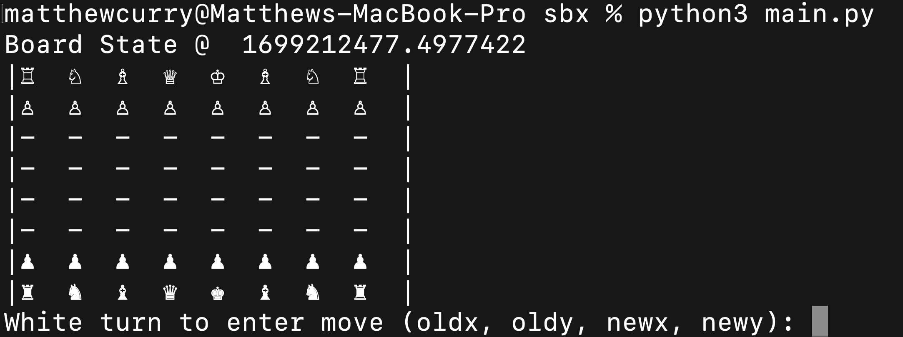
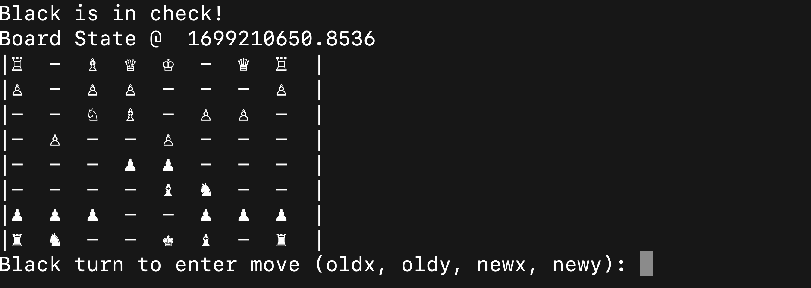

# Welcome to the SBX Chess Engine remote repository!

#### This is a personal project by Matthew Curry as an exercise in object-oriented programming, efficient algorithmic design, and feature extraction to update a reinforcement learning model. SBX is an ongoing project that will use a mixture of standard tree search and RL feedback to play chess versus humans and other AIs, learned on games played by professional players.

## Current status:

### Board and Piece Representation :white_check_mark:
#### The board state is an 8x8 matrix where each piece is represented by a hexadecimal number class in *bitmap.txt*, which encodes **white pieces &#8773; 0 (mod 2)** and **black pieces &#8773; 1 (mod 2)**. This was done to allow quick comparisons between pieces on the board without the use of explicit piece classes.

### Chess Rules and Logic :white_check_mark:
#### The Chess class in *Chess.py* is a wrapper for our board state which implements sequential turn based inputs for the legal moves of standard chess. Input is accepted as (x0, y0, x1, y1) and will only apply the move if it is a legal move for the piece @ (x0, y0). After a move is taken, determine if the chess board is in a state of check or checkmate and filter the legal moves based on those conditions.

### Opponent AI (Minimax/ab-pruning) :black_small_square: :black_small_square: :black_small_square:

