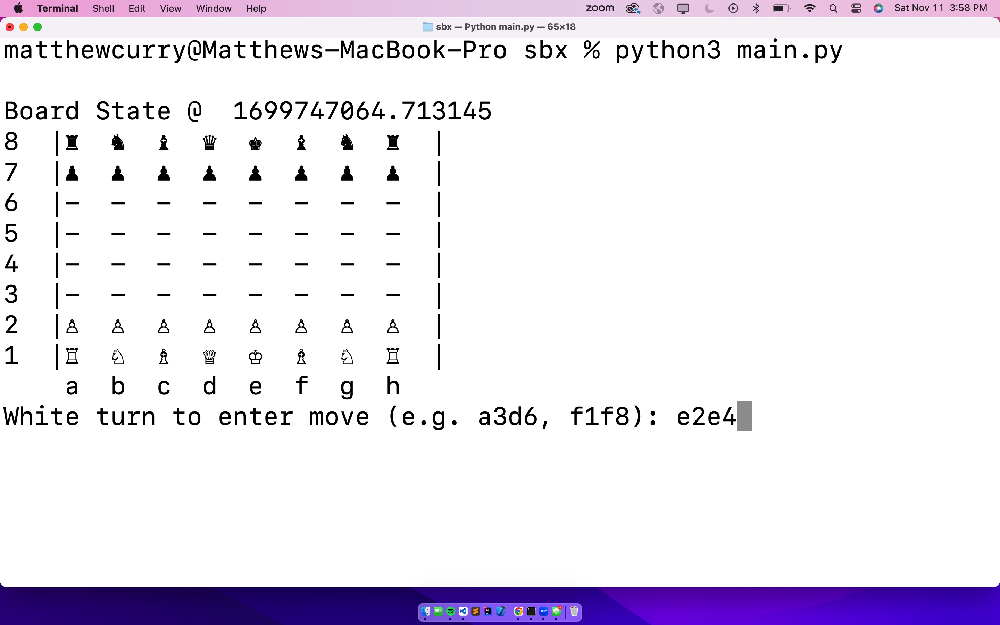
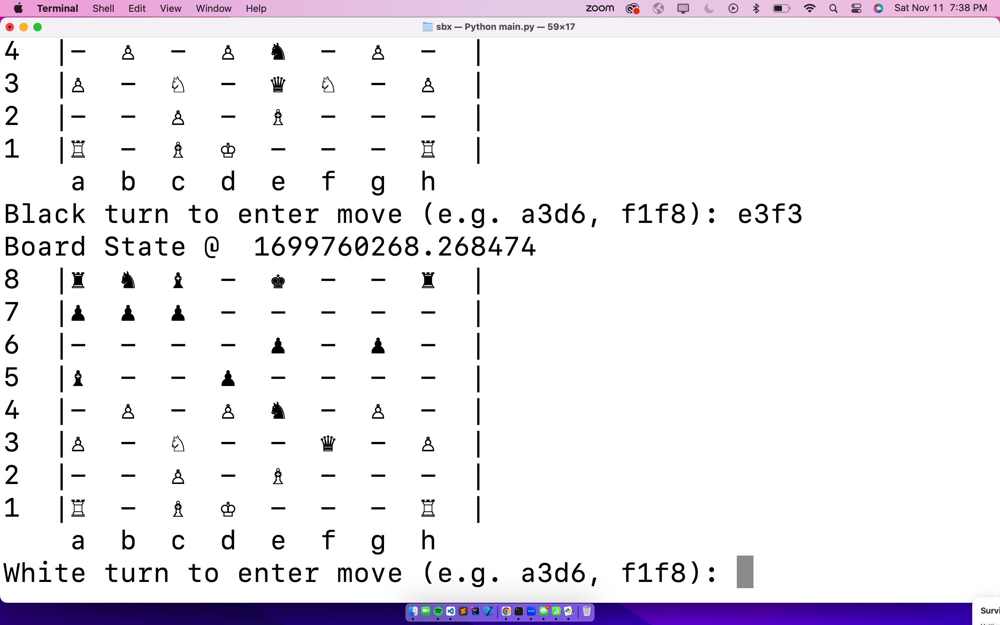

# Welcome to the SBX Chess Engine remote repository! 

# SBX is a terminal-based chess engine where a user can play against a chess AI (LenaAI).

# Clone this repo, cd into respective directory and enter command **python3 main.py** to play a standard game of chess

# Currently user input is accepted as a tuple of coordinates on the board (x0, y0, x1, y1) represents a move of piece @(x0, y0) -> (x1, y1)

# This is a personal project that I am still developing actively (as of 3/5/2024) as an exercise in OOP, design, search algorithm implementation, and more!

